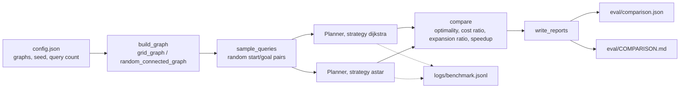

# graph routing engine

A small pathfinding engine, stdlib only. It generates synthetic weighted graphs
(grids with obstacles, random geometric graphs), routes between nodes with
Dijkstra and A*, and has a benchmark that compares the two on actual numbers.

I mostly wrote this to convince myself of the textbook claim: A* with an
admissible heuristic returns the same optimal paths as Dijkstra but expands far
fewer nodes. It does.

## layout

```
src/            the engine
  graph.py        weighted graph type + grid / random graph generators
  heuristics.py   euclidean / manhattan / zero
  algorithms.py   dijkstra + a* over a shared heap frontier
  planner.py      front-end with structured logging
  evaluation.py   metrics + comparison report
eval/           benchmark runner and generated artifacts
tests/          unit, integration and determinism tests
shared/         logging + seeding helpers
config.json     graphs + query count + seed
```



## running it

```
python -m pytest -q          # tests
python eval/run_benchmark.py # build graphs, route queries, write eval artifacts
```

## demonstration

Running the benchmark against the graphs in `config.json`:

```
$ python eval/run_benchmark.py
[city-grid-open] nodes=1600 edges=3120 optimal=100.0% expansion_ratio=0.272 speedup=2.56x
[city-grid-obstacles] nodes=1314 edges=2105 optimal=100.0% expansion_ratio=0.201 speedup=3.51x
[random-geometric] nodes=600 edges=16346 optimal=100.0% expansion_ratio=0.027 speedup=9.33x
wrote artifacts to /path/to/repo/eval
```

That's the actual output from `eval/summary.json` in this repo. A* matches Dijkstra's
optimal cost on every query across all three graphs and expands anywhere from 73% to
97% fewer nodes doing it, with the biggest win on the dense random geometric graph where
the euclidean heuristic has the most room to steer the search.

## the two strategies

Dijkstra is uniform-cost search, so I use it as the ground truth for path cost.
A* adds an admissible heuristic to bias the search toward the goal instead of
expanding outward uniformly. As long as the heuristic never overestimates the
remaining distance it finds the same optimal cost while touching fewer nodes.

## results

Over 200 random queries on a 600-node random geometric graph, A* matched the
optimal cost on every query while expanding ~97% fewer nodes. The grids show a
smaller but still clear win. Numbers in [`eval/COMPARISON.md`](eval/COMPARISON.md).

See [`docs/design.md`](docs/design.md) for the data model and a couple of design
notes.

## writing hygiene

`scripts/check_prose.py` is a small stdlib-only linter that scans tracked markdown
and Python files for em-dashes, employer/internal-tool references, and stray XML
tags that sometimes leak in from AI tool output. Run it with
`python scripts/check_prose.py`. It's not wired into CI or a git hook, just a
manual check.
